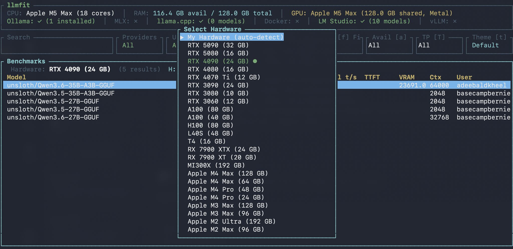

# llmfit

<p align="center">
  
</p>

<p align="center">
  <a href="README.md">English</a> ·
  <a href="README.zh.md">中文</a> ·
  <b>日本語</b>
</p>

<p align="center">
  <a href="https://github.com/AlexsJones/llmfit/actions/workflows/ci.yml"></a>
  <a href="https://crates.io/crates/llmfit"></a>
  <a href="LICENSE"></a>
  <a href="https://about.signpath.io"></a>
</p>

> **📊 新機能：ベンチマーク＆共有 — あなたのマシンの実測値が、みんなの推定精度を高めます。** `llmfit bench --share` はあなたのハードウェアで実際の tok/s を計測し、PR としてプロジェクトに還元します — `gh` CLI もサードパーティのアカウントも不要です。実行結果はまずローカルに保存され（共有をスキップして、後からまとめてアップロードも可能）、自分の実測値はフィットテーブルの推定値を置き換えます。マージされた提出は次のリリースに同梱され、同一ハードウェアのユーザーはベンチマークを実行する前から実測 `✓` 値と校正済みの推定値を得られます。[共有をはじめる →](docs/cli.md#contributing-benchmarks-bench---share)
>
> *これまで：[llmfit 1.0 — すべての数値が検証可能になったリリース →](https://github.com/AlexsJones/llmfit/discussions/708)*

**数百のモデルとプロバイダー。自分のハードウェアで動くものを見つけるコマンドはひとつ。**

LLM モデルをシステムの RAM、CPU、GPU に合わせて最適化するターミナルツールです。ハードウェアを検出し、各モデルを品質・速度・適合度・コンテキストの各観点でスコアリングして、あなたのマシンで実際に快適に動くものを教えてくれます。

インタラクティブな TUI（デフォルト）と従来型の CLI モードを備えています。マルチ GPU 構成、MoE アーキテクチャ、動的な量子化選択、速度推定、ローカルランタイムプロバイダー（Ollama、llama.cpp、MLX、Docker Model Runner、LM Studio）に対応しています。

**新機能: [コミュニティリーダーボード](#コミュニティリーダーボード-b)（`b`）** — 同じハードウェアを使う他のユーザーから集まった実環境の tok/s、TTFT、VRAM 使用量を確認できます。[localmaxxing.com](https://localmaxxing.com) を利用し、推定パフォーマンスと実測パフォーマンスの差を埋めます。

その他: [ダウンロードマネージャー](#ダウンロードマネージャー-d)（`D`）、[詳細設定](#詳細設定-a)（`A`）、[ハードウェアシミュレーション](#ハードウェアシミュレーション-s) — `D` を押すとダウンロードの管理、履歴の閲覧、モデルの削除、ダウンロードディレクトリの設定ができます。`A` を押すと TPS 効率、実行モード係数、スコアリングの重みを調整できます。`S` を押すと別のハードウェアをシミュレーションできます。

> **姉妹プロジェクト:**
> - [sympozium](https://github.com/sympozium-ai/sympozium/) — Kubernetes でエージェントを管理。
> - [llmserve](https://github.com/AlexsJones/llmserve) — ローカル LLM モデルをサーブするためのシンプルな TUI。モデルを選び、バックエンドを選び、サーブする。
> - [llama-panel](https://github.com/AlexsJones/llama-panel) — ローカルの llama-server インスタンスを管理するネイティブ macOS アプリ。


---

## インストール

### Windows
```sh
scoop install llmfit
```

Scoop がインストールされていない場合は、[Scoop インストールガイド](https://scoop.sh/)に従ってください。

### macOS / Linux

#### Homebrew

ビルド済みバイナリ（推奨。すべての macOS/Linux バージョンで動作）:
```sh
brew install AlexsJones/llmfit/llmfit
```

または homebrew-core の formula から。bottle がない macOS バージョンではソースからビルドされます:
```sh
brew install llmfit
```

#### MacPorts
```sh
port install llmfit
```

#### クイックインストール
```sh
curl -fsSL https://llmfit.axjns.dev/install.sh | sh
```

GitHub から最新リリースのバイナリをダウンロードし、`/usr/local/bin`（sudo がない場合は `~/.local/bin`）にインストールします。

**sudo なしで `~/.local/bin` にインストール:**
```sh
curl -fsSL https://llmfit.axjns.dev/install.sh | sh -s -- --local
```

### uv / pip
llmfit をインストールまたは更新するには:
```sh
uv tool install -U llmfit
```

インストールせずに実行するには:
```sh
uvx llmfit
```

pip や uv などのツールを使って、通常の方法で llmfit を Python パッケージとしてインストールすることもできます。

### Docker / Podman
```sh
docker run ghcr.io/alexsjones/llmfit
```
これは `llmfit recommend` コマンドの JSON を出力します。この JSON は `jq` でさらにクエリできます。
```
podman run ghcr.io/alexsjones/llmfit recommend --use-case coding | jq '.models[].name'
```

### ソースから
```sh
git clone https://github.com/AlexsJones/llmfit.git
cd llmfit
cargo build --release
# バイナリは target/release/llmfit にあります
```

---

## 使い方

### TUI（デフォルト）

```sh
llmfit
```

インタラクティブなターミナル UI を起動します。システムスペック（CPU、RAM、GPU 名、VRAM、バックエンド）が上部に表示されます。モデルは複合スコア順に並んだスクロール可能なテーブルに一覧表示されます。各行には、モデルのスコア、推定 tok/s、あなたのハードウェアに最適な量子化、実行モード、メモリ使用量、ユースケースカテゴリが表示されます。

| キー                       | アクション                                                              |
|----------------------------|-----------------------------------------------------------------------|
| `Up` / `Down` または `j` / `k` | モデルを移動                                                          |
| `/`                        | 検索モードに入る（名前、プロバイダー、パラメータ、ユースケースの部分一致） |
| `Esc` または `Enter`       | 検索モードを終了                                                      |
| `Ctrl-U`                   | 検索をクリア                                                          |
| `f`                        | 適合フィルターを切り替え: All、Runnable、Perfect、Good、Marginal       |
| `a`                        | 利用可否フィルターを切り替え: All、GGUF Avail、Installed               |
| `s`                        | ソート列を切り替え: Score、Params、Mem%、Ctx、Date、Use Case          |
| `v`                        | Visual モードに入る（複数モデルを選択）                                |
| `V`                        | Select モードに入る（列ベースのフィルタリング）                       |
| `t`                        | カラーテーマを切り替え（自動保存）                                     |
| `p`                        | 選択したモデルの Plan モードを開く（ハードウェアプランニング）         |
| `P`                        | プロバイダーフィルターのポップアップを開く（入力で曖昧フィルタリング） |
| `U`                        | ユースケースフィルターのポップアップを開く                            |
| `C`                        | 機能フィルターのポップアップを開く                                    |
| `L`                        | ライセンスフィルターのポップアップを開く                              |
| `R`                        | ランタイム/バックエンドフィルターのポップアップを開く（llama.cpp、MLX、vLLM） |
| `S`                        | ハードウェアシミュレーションのポップアップを開く（RAM/VRAM/CPU を上書き） |
| `A`                        | 詳細設定のポップアップを開く（効率や実行モード係数を調整）             |
| `b`                        | コミュニティリーダーボードビューを開く（localmaxxing.com）            |
| `I`                        | 推論ベンチビューを開く（あなたのモデルに対するローカル品質スコアリング） |
| `h`                        | ヘルプポップアップを開く（すべてのキーバインド）                       |
| `m`                        | 選択したモデルを比較対象にマーク                                       |
| `c`                        | 比較ビューを開く（マーク済み vs 選択中）                               |
| `x`                        | 比較マークをクリア                                                    |
| `i`                        | インストール済み優先ソートを切り替え（検出された任意のランタイムプロバイダー） |
| `d`                        | 選択したモデルをダウンロード（複数利用可能ならプロバイダー選択）       |
| `D`                        | ダウンロードマネージャーを開く（履歴、削除、設定）                     |
| `r`                        | ランタイムプロバイダーからインストール済みモデルを再読み込み           |
| `Enter`                    | 選択したモデルの詳細ビューを切り替え                                   |
| `PgUp` / `PgDn`            | 10 件単位でスクロール                                                 |
| `g` / `G`                  | 先頭 / 末尾にジャンプ                                                 |
| `q`                        | 終了                                                                 |

### Vim 風モード

TUI は左下のステータスバーに表示される Vim 由来のモードを使用します。現在のモードによって、どのキーが有効かが決まります。

#### Normal モード

デフォルトのモードです。移動、検索、フィルタリング、ビューの表示を行います。上の表のすべてのキーがここで適用されます。

#### Visual モード（`v`）

一括比較のために連続したモデルの範囲を選択します。`v` を押して現在の行を起点に固定し、`j`/`k` または矢印キーで移動して選択範囲を広げます。選択された行はハイライトされます。

| キー                | アクション                                             |
|---------------------|--------------------------------------------------------|
| `j` / `k` または矢印 | 選択範囲を上下に拡張                                   |
| `c`                 | 選択したすべてのモデルを比較（マルチ比較ビューを開く） |
| `m`                 | 現在のモデルを 2 モデル比較用にマーク                  |
| `Esc` または `v`    | Visual モードを終了                                   |

マルチ比較ビューは、行が属性（Score、tok/s、Fit、Mem%、Params、Mode、Context、Quant など）、列がモデルとなるテーブルを表示します。最良の値はハイライトされます。画面に収まらないほど多くのモデルを選択した場合は、`h`/`l` または矢印キーで横スクロールできます。

#### Select モード（`V`）

列ベースのアクションです。`V`（shift-v）を押して Select モードに入り、`h`/`l` または矢印キーで列ヘッダー間を移動します。アクティブな列は視覚的にハイライトされます。`Enter` または `Space` を押すと、その列の現在のアクションが実行されます。

| 列                            | フィルターアクション                                                      |
|-------------------------------|---------------------------------------------------------------------------|
| Inst                          | 利用可否フィルターを切り替え                                             |
| Model                         | 検索モードに入る                                                         |
| Provider                      | プロバイダーポップアップを開く                                           |
| Params                        | パラメータサイズのバケットポップアップを開く（<3B、3-7B、7-14B、14-30B、30-70B、70B+） |
| Score, tok/s, Mem%, Ctx, Date | その列でソート                                                          |
| Quant                         | 量子化ポップアップを開く                                                 |
| Mode                          | 実行モードポップアップを開く（GPU、MoE、CPU+GPU、CPU）                   |
| Fit                           | 適合フィルターを切り替え                                                 |
| Use Case                      | ユースケースポップアップを開く                                           |

Select モードでも行のナビゲーションは引き続き機能するため、アクションを適用しながらその効果を確認できます: `j`/`k`、矢印キー、`Ctrl-U`、`Ctrl-D`、`PageUp`、`PageDown`、`Home`、`End`。`Esc` を押すと Normal モードに戻ります。

### TUI Plan モード（`p`）

Plan モードは通常の適合分析を反転させます。「何が自分のハードウェアに収まるか?」ではなく、「このモデル構成にはどんなハードウェアが必要か?」を推定します。

選択した行で `p` を押し、次のように操作します:

| キー                   | アクション                                                |
|------------------------|-----------------------------------------------------------|
| `Tab` / `j` / `k`      | 編集可能なフィールド間を移動（Context、Quant、Target TPS） |
| `Left` / `Right`       | 現在のフィールド内でカーソルを移動                        |
| 入力                   | 現在のフィールドを編集                                    |
| `Backspace` / `Delete` | 文字を削除                                                |
| `Ctrl-U`               | 現在のフィールドをクリア                                  |
| `Esc` または `q`       | Plan モードを終了                                         |

Plan モードは以下の推定値を表示します:
- 最小および推奨の VRAM/RAM/CPU コア数
- 実行可能な実行パス（GPU、CPU オフロード、CPU のみ）
- より良い適合目標に到達するためのアップグレード差分

### ハードウェアシミュレーション（`S`）

`S` を押すとハードウェアシミュレーションのポップアップが開きます。RAM、VRAM、CPU コア数を上書きして、別のターゲットハードウェアでどのモデルが収まるかを確認できます。すべてのモデルスコア、適合レベル、速度推定は、シミュレーションされたスペックに対して即座に再計算されます。


| キー                   | アクション                              |
|------------------------|-----------------------------------------|
| `Tab` / `j` / `k`      | RAM、VRAM、CPU フィールドを切り替え     |
| 数字を入力             | 選択したフィールドを編集                |
| `Enter`               | シミュレーションを適用                  |
| `Ctrl-R`              | 実際に検出されたハードウェアにリセット  |
| `Esc`                 | キャンセルして閉じる                    |

シミュレーションが有効なときは、システムバーとステータスバーに `SIM` バッジが表示されます。リセットするまで、モデルテーブル全体がシミュレーションされたハードウェアを反映します。

### 詳細設定（`A`）

`A` を押すと詳細設定のポップアップが開きます。このパネルでは、TPS 推定、実行モードのペナルティ、複合スコアリングの背後にあるパラメータを調整できます。これは特定のモデル（例: Qwen3 30B）で tok/s が過大評価されていた[issue #449](https://github.com/AlexsJones/llmfit/issues/449)に対応するものです。

すべての変更は即座に適用され、モデルテーブルが再計算されます。`Esc` で確定して閉じるか、`Ctrl-R` でデフォルトにリセットします。

| フィールド         | 説明                                                                     | デフォルト |
|--------------------|-------------------------------------------------------------------------|---------|
| **Efficiency**     | 帯域幅ベースの TPS のグローバル効率係数。オーバーヘッドを考慮             | `0.55`  |
| **GPU factor**     | 純粋な GPU 推論の速度倍率                                                 | `1.0`   |
| **CPU Offload**    | 重みがシステム RAM にあふれた場合の速度倍率                               | `0.5`   |
| **MoE Offload**    | Mixture-of-Experts のエキスパート切り替えの速度倍率                       | `0.8`   |
| **Tensor Par**     | テンソル並列推論の速度倍率                                                | `0.9`   |
| **CPU Only**       | CPU のみの実行の速度倍率                                                  | `0.3`   |
| **Context cap**    | メモリ推定に使用する最大コンテキスト長（デフォルトの場合は空欄のまま）    | `auto`  |

| キー                   | アクション                              |
|------------------------|-----------------------------------------|
| `Tab` / `j` / `k`      | フィールドを切り替え                    |
| 数字 / `.` を入力      | 選択したフィールドを編集                |
| `Left` / `Right`       | フィールド内でカーソルを移動            |
| `Backspace` / `Delete` | 文字を削除                              |
| `Ctrl-U`               | 現在のフィールドをクリア                |
| `Enter`                | 変更を適用してすべてのスコアを再計算    |
| `Esc` / `q`            | 適用せずに閉じる                        |

### ダウンロードマネージャー（`D`）

`D` を押すとダウンロードマネージャービューが開きます。このフルスクリーンビューはメインのモデルテーブルに置き換わり、3 つのセクションを提供します:

- **Active Download** — 進行中の現在のダウンロードを、プログレスバー、モデル名、ステータスメッセージとともに表示します。
- **Config** — GGUF モデルディレクトリを表示（および編集可能）します。設定したパスはセッションをまたいで永続化されます。
- **History** — 過去のダウンロードのナビゲート可能なリスト（新しい順）を、モデル名、プロバイダー、ステータス、日付とともに表示します。失敗したダウンロードは履歴から削除でき、成功したダウンロードはプロバイダーから削除できます。

`Tab` / `Shift-Tab` でセクション間のフォーカスを切り替えます。

| キー                   | アクション                                       |
|------------------------|--------------------------------------------------|
| `Tab` / `Shift-Tab`   | フォーカスを切り替え: Active → Config → History   |
| `j` / `k` または矢印  | 履歴リストをナビゲート（History にフォーカス時）  |
| `x`                   | 選択したモデルを削除（確認を求められる）          |
| `y` / `n`             | 削除を確認またはキャンセル                        |
| `e`                   | ダウンロードディレクトリを編集（Config にフォーカス時） |
| `Enter`               | ディレクトリ編集を確定                            |
| `Esc` / `D` / `q`    | 閉じてモデルテーブルに戻る                        |

失敗したダウンロード（例: 404 エラー）の場合、`x` は履歴からエントリを削除します。成功したダウンロードの場合は、プロバイダーからモデルを削除します（Ollama と llama.cpp でサポート）。

### コミュニティリーダーボード（`b`）

`b` を押すとコミュニティリーダーボードビューが開きます。llmfit の理論的な速度推定だけに頼るのではなく、このビューでは同じハードウェアを使う他のユーザーから集まった**実環境のパフォーマンスデータ** — 実測の tok/s、最初のトークンまでの時間、ピーク VRAM 使用量 — を表示します。



データはコミュニティのベンチマークデータベースである [localmaxxing.com](https://localmaxxing.com) から取得されます。ビューを開くと、llmfit はあなたのハードウェア（GPU モデル、VRAM ティア、Apple Silicon チップファミリー、OS）を自動検出し、一致する結果をクエリします。

| 列           | 説明                                                     |
|--------------|----------------------------------------------------------|
| **Model**    | HuggingFace モデル ID                                    |
| **Engine**   | 使用された推論ランタイム（llama.cpp、vLLM、Ollama、MLX...） |
| **Quant**    | 量子化フォーマット（Q4_K_M、Q8_0 など）                  |
| **tok/s**    | 実測の出力トークン生成速度                                |
| **Total t/s**| 総スループット（プロンプト + 生成）                       |
| **TTFT**     | 最初のトークンまでの時間（レイテンシ）                    |
| **VRAM**     | 推論中のピークメモリ使用量                                |
| **Ctx**      | ベンチマークで使用されたコンテキスト長                    |
| **User**     | 投稿者（認証済みユーザーは `*` でマーク）                 |

| キー                   | アクション                              |
|------------------------|-----------------------------------------|
| `j` / `k` または矢印  | 結果をナビゲート                        |
| `H`                    | ハードウェアピッカーを開く（任意の GPU を閲覧） |
| `r`                    | API から再取得 / リフレッシュ           |
| `b` / `q` / `Esc`     | 閉じてモデルテーブルに戻る              |

`H` を押すとハードウェアピッカーが開きます。これは 27 種類の人気 GPU とチップ（RTX 5090 から CPU のみまで、加えて Apple Silicon M1–M4 バリアント、AMD RX/MI シリーズ、NVIDIA データセンターカード）のスクロール可能なリストです。1 つ選ぶと、たとえそれが自分の使っているものでなくても、そのハードウェアのベンチマークを即座に読み込めます。「My Hardware (auto-detect)」を選ぶと自分のシステムに戻ります。

#### API キーの設定

公開ベンチマークは認証なしで利用できます。フルアクセスには [localmaxxing.com](https://localmaxxing.com) の API キーを指定します:

```sh
# 環境変数経由（推奨）
export LOCALMAXXING_API_KEY="bhk_your_key_here"
llmfit

# または CLI フラグ経由
llmfit --api-key "bhk_your_key_here"
```

| 変数 | 説明 |
|---|---|
| `LOCALMAXXING_API_KEY` | localmaxxing.com API のベアラートークン |

### 推論ベンチ（`I`）

`I`（大文字）を押すと推論ベンチビューが開きます。これは**ローカルで実行中のプロバイダー** — Ollama、vLLM、MLX — に対して**ライブの推論ベンチマーク**を実行し、実際の推論リクエストで最初のトークンまでの時間（TTFT）、毎秒トークン数（TPS）、総レイテンシを測定します。

コミュニティリーダーボード（他のユーザーから集めたクラウドソースのデータを表示）とは異なり、推論ベンチはあなたの実際のハードウェアであなたの実際のモデルを測定します。

#### TUI での使い方

| キー | アクション |
|-----|--------|
| `I` | 推論ベンチを開く（プロバイダーを自動検出してベンチマークを実行） |
| `I`（再度） | ベンチビュー内からベンチマークを再実行 |
| `j` / `k` または矢印 | モデル結果をナビゲート |
| `Enter` | 選択したモデルの詳細ビューを開く |
| `r` | ルーティングマトリックスビューに切り替え |
| `q` / `Esc` | ベンチビューを閉じる |

結果は `~/.config/llmfit/bench-cache.json` にキャッシュされ、次回以降は即座に読み込まれます。

#### CLI での使い方

```sh
# プロバイダーを自動検出してベンチマーク
llmfit bench

# 実行中のすべてのプロバイダーで検出されたすべてのモデルをベンチマーク
llmfit bench --all

# Ollama 経由で特定のモデルをベンチマーク
llmfit bench --provider ollama llama3.2

# エンドポイント URL を上書き
llmfit bench --provider ollama --url http://my-server:11434 llama3.2

# vLLM エンドポイントを上書き
llmfit bench --provider vllm --url http://localhost:8000

# JSON として出力（スクリプト用）
llmfit bench --json

# 品質ベンチマークを実行（ルーティング用のロールベーススコアリング）
llmfit bench --quality

# ルーティングマトリックスを出力
llmfit bench --quality --routing
```

#### 環境変数

| 変数 | デフォルト | 説明 |
|---|---|---|
| `OLLAMA_HOST` | `http://localhost:11434` | Ollama API のベース URL |
| `VLLM_PORT` | `8000` | vLLM サーバーのポート（`http://localhost:$VLLM_PORT` として使用） |

### テーマ

`t` を押すと 10 種類の組み込みカラーテーマを切り替えられます。選択は `~/.config/llmfit/theme` に自動保存され、次回起動時に復元されます。

| テーマ                   | 説明                                              |
|--------------------------|---------------------------------------------------|
| **Default**              | オリジナルの llmfit カラー                        |
| **Dracula**              | 暗い紫の背景にパステルのアクセント                |
| **Solarized**            | Ethan Schoonover の Solarized Dark パレット       |
| **Nord**                 | 北極風の涼しげな青灰色のトーン                    |
| **Monokai**              | Monokai Pro の暖かいシンタックスカラー            |
| **Gruvbox**              | 暖かいアースカラーのレトログルーヴパレット        |
| **Catppuccin Latte**     | 🌻 ライトテーマ — 調和の取れたパステルの反転      |
| **Catppuccin Frappé**    | 🪴 低コントラストのダーク — 落ち着いた控えめな美学 |
| **Catppuccin Macchiato** | 🌺 中コントラストのダーク — 穏やかで安らぐトーン  |
| **Catppuccin Mocha**     | 🌿 最も暗いバリアント — 色彩豊かなアクセントで居心地よく |

### Web ダッシュボード

`llmfit` を非 JSON モードで実行すると、`0.0.0.0:8787` でバックグラウンドの Web ダッシュボードが自動的に起動します。同じネットワーク上の任意のブラウザで開けます:

```
http://<your-machine-ip>:8787
```

ホストやポートは環境変数で上書きできます:

```sh
LLMFIT_DASHBOARD_HOST=0.0.0.0 LLMFIT_DASHBOARD_PORT=9000 llmfit
```

| 変数 | デフォルト | 説明 |
|---|---|---|
| `LLMFIT_DASHBOARD_HOST` | `0.0.0.0` | ダッシュボードサーバーをバインドするインターフェース |
| `LLMFIT_DASHBOARD_PORT` | `8787` | ダッシュボードサーバーをバインドするポート |

自動起動するダッシュボードを無効にするには、`--no-dashboard` を渡します:

```sh
llmfit --no-dashboard
```

### CLI モード

`--cli` または任意のサブコマンドを使うと、従来型のテーブル出力が得られます:

```sh
# 適合度でランク付けされたすべてのモデルのテーブル
llmfit --cli

# 完全に適合するモデルのみ、上位 5 件
llmfit fit --perfect -n 5

# 検出されたシステムスペックを表示
llmfit system

# データベース内のすべてのモデルを一覧表示
llmfit list

# 名前、プロバイダー、サイズで検索
llmfit search "llama 8b"

# 単一モデルの詳細ビュー
llmfit info "Mistral-7B"

# 上位 5 件の推奨（JSON、エージェント/スクリプト消費用）
llmfit recommend --json --limit 5

# ユースケースでフィルタリングした推奨
llmfit recommend --json --use-case coding --limit 3

# 特定のランタイムを強制（Apple Silicon での自動 MLX 選択をバイパス）
llmfit recommend --force-runtime llamacpp
llmfit recommend --force-runtime llamacpp --use-case coding --limit 3

# 特定のモデル構成に必要なハードウェアをプラン
llmfit plan "Qwen/Qwen3-4B-MLX-4bit" --context 8192
llmfit plan "Qwen/Qwen3-4B-MLX-4bit" --context 8192 --quant mlx-4bit
llmfit plan "Qwen/Qwen3-4B-MLX-4bit" --context 8192 --target-tps 25 --json

# ノードレベルの REST API として実行（クラスタースケジューラー / アグリゲーター用）
llmfit serve --host 0.0.0.0 --port 8787
```

### REST API（`llmfit serve`）

`llmfit serve` は、TUI/CLI で使われるのと同じ適合度/スコアリングデータを公開する HTTP API を起動します。これにはノードのフィルタリングや上位モデルの選択も含まれます。

```sh
# 生存確認
curl http://localhost:8787/health

# ノードのハードウェア情報
curl http://localhost:8787/api/v1/system

# フィルター付きの完全な適合リスト
curl "http://localhost:8787/api/v1/models?min_fit=marginal&runtime=llamacpp&sort=score&limit=20"

# 主要なスケジューリングエンドポイント: このノードで実行可能な上位モデル
curl "http://localhost:8787/api/v1/models/top?limit=5&min_fit=good&use_case=coding"

# モデル名/プロバイダーのテキストで検索
curl "http://localhost:8787/api/v1/models/Mistral?runtime=any"
```

`models`/`models/top` でサポートされるクエリパラメータ:

- `limit`（または `n`）: 返される行の最大数
- `perfect`: `true|false`（`true` で完全適合のみを強制）
- `min_fit`: `perfect|good|marginal|too_tight`
- `runtime`: `any|mlx|llamacpp`
- `use_case`: `general|coding|reasoning|chat|multimodal|embedding`
- `provider`: プロバイダーのテキストフィルター（部分文字列）
- `search`: 名前/プロバイダー/サイズ/ユースケースにわたる自由テキストフィルター
- `sort`: `score|tps|params|mem|ctx|date|use_case`
- `include_too_tight`: 実行不可能な行を含める（`/top` ではデフォルト `false`、`/models` では `true`）
- `max_context`: メモリ推定のためのリクエストごとのコンテキスト上限
- `force_runtime`: `mlx|llamacpp|vllm` — 分析中の自動ランタイム選択を上書き

API の動作をローカルで検証:

```sh
# サーバーを自動的に起動し、エンドポイント/スキーマ/フィルターのアサーションを実行
python3 scripts/test_api.py --spawn

# またはすでに実行中のサーバーをテスト
python3 scripts/test_api.py --base-url http://127.0.0.1:8787
```

### ハードウェアの上書き

ハードウェアの自動検出は一部のシステム（例: 壊れた `nvidia-smi`、VM、パススルー構成）で失敗することがあります。また、別のターゲットハードウェアに対してモデルの適合度を評価したい場合もあるでしょう。`--memory`、`--ram`、`--cpu-cores` を使って検出された値を上書きできます:

```sh
# GPU VRAM を上書き
llmfit --memory=32G

# システム RAM を上書き
llmfit --ram=128G

# CPU コア数を上書き
llmfit --cpu-cores=16

# 上書きを組み合わせてターゲットハードウェアをシミュレーション
llmfit --memory=24G --ram=64G --cpu-cores=8 fit
llmfit --memory=24G --ram=64G system --json

# すべてのモードで動作: TUI、CLI、サブコマンド
llmfit --memory=24G --cli
llmfit --memory=24G fit --perfect -n 5
llmfit --ram=64G recommend --json
```

`--memory` と `--ram` で使える接尾辞: `G`/`GB`/`GiB`（ギガバイト）、`M`/`MB`/`MiB`（メガバイト）、`T`/`TB`/`TiB`（テラバイト）。大文字小文字は区別されません。GPU が検出されなかった場合、`--memory` は合成 GPU エントリを作成し、モデルが GPU 推論用にスコアリングされるようにします。統合メモリシステム（Apple Silicon）では、`--ram` は VRAM も更新します。VRAM を独立して上書きするには `--memory` を使ってください。

### 推定用のコンテキスト長の上限

`--max-context` を使うと、メモリ推定に使用するコンテキスト長を上限で制限できます（各モデルが公称する最大コンテキストは変更しません）:

```sh
# 4K コンテキストでメモリ適合度を推定
llmfit --max-context 4096 --cli

# サブコマンドで動作
llmfit --max-context 8192 fit --perfect -n 5
llmfit --max-context 16384 recommend --json --limit 5
```

`--max-context` が設定されていない場合、llmfit は利用可能であれば `OLLAMA_CONTEXT_LENGTH` を使用します。

### JSON 出力

任意のサブコマンドに `--json` を追加すると、機械可読な出力が得られます:

```sh
llmfit --json system     # ハードウェアスペックを JSON で
llmfit --json fit -n 10  # 上位 10 件の適合を JSON で
llmfit recommend --json  # 上位 5 件の推奨（recommend では JSON がデフォルト）
llmfit plan "Qwen/Qwen2.5-Coder-0.5B-Instruct" --context 8192 --json
```

`plan` の JSON には以下の安定したフィールドが含まれます:
- リクエスト（`context`、`quantization`、`target_tps`）
- 推定された最小/推奨ハードウェア
- パスごとの実行可能性（`gpu`、`cpu_offload`、`cpu_only`）
- アップグレード差分

---

## 仕組み

1. **ハードウェア検出** -- `sysinfo` で合計/利用可能 RAM を読み取り、CPU コアを数え、GPU を探索します:
   - **NVIDIA** -- `nvidia-smi` によるマルチ GPU サポート。検出されたすべての GPU の VRAM を集約します。レポートが失敗した場合は GPU モデル名から VRAM を推定してフォールバックします。
   - **AMD** -- `rocm-smi` で検出。
   - **Intel Arc** -- ディスクリート VRAM は sysfs 経由、統合は `lspci` 経由。
   - **Apple Silicon** -- `system_profiler` 経由の統合メモリ。VRAM = システム RAM。
   - **Ascend** -- `npu-smi` で検出。
   - **バックエンド検出** -- 速度推定のために、アクセラレーションバックエンド（CUDA、Metal、ROCm、SYCL、CPU ARM、CPU x86、Ascend）を自動的に識別します。

2. **モデルデータベース** -- HuggingFace API から取得した数百のモデルを `data/hf_models.json` に保存し、コンパイル時に埋め込みます。メモリ要件は、量子化階層（Q8_0 から Q2_K まで）にわたるパラメータ数から計算されます。VRAM は GPU 推論の主要な制約であり、システム RAM は CPU のみの実行のフォールバックです。

   **MoE サポート** -- Mixture-of-Experts アーキテクチャを持つモデル（Mixtral、DeepSeek-V2/V3）は自動的に検出されます。トークンごとにアクティブになるのはエキスパートの一部のみなので、実効 VRAM 要件は総パラメータ数が示すよりもはるかに低くなります。例えば、Mixtral 8x7B は総パラメータ 46.7B ですが、トークンごとにアクティブになるのは約 12.9B のみで、エキスパートオフロードにより VRAM が 23.9 GB から約 6.6 GB に削減されます。

3. **動的量子化** -- 固定の量子化を仮定する代わりに、llmfit はあなたのハードウェアに収まる最高品質の量子化を試します。Q8_0（最高品質）から Q2_K（最も圧縮）までの階層をたどり、利用可能なメモリに収まる最高品質のものを選びます。フルコンテキストで何も収まらない場合は、半分のコンテキストで再試行します。

4. **多次元スコアリング** -- 各モデルは 4 つの次元（それぞれ 0〜100）でスコアリングされます:

   | 次元        | 測定するもの                                                                   |
   |-------------|--------------------------------------------------------------------------------|
   | **Quality** | パラメータ数、モデルファミリーの評判、量子化ペナルティ、タスク整合性           |
   | **Speed**   | バックエンド、パラメータ、量子化に基づく推定トークン/秒                        |
   | **Fit**     | メモリ使用効率（最適点: 利用可能メモリの 50〜80%）                             |
   | **Context** | ユースケースに対するコンテキストウィンドウ能力 vs ターゲット                   |

   各次元は重み付き複合スコアに統合されます。重みはユースケースカテゴリ（General、Coding、Reasoning、Chat、Multimodal、Embedding）によって異なります。例えば、Chat は Speed を高く重み付け（0.35）し、Reasoning は Quality を高く重み付け（0.55）します。モデルは複合スコアでランク付けされ、実行不可能なモデル（Too Tight）は常に最下位になります。

5. **速度推定** -- LLM 推論におけるトークン生成はメモリ帯域幅に律速されます。各トークンは VRAM からモデルの全重みを一度読み取る必要があります。GPU モデルが認識されると、llmfit はその実際のメモリ帯域幅を使ってスループットを推定します:

   計算式: `(bandwidth_GB_s / model_size_GB) × efficiency_factor`

   効率係数（0.55）とモードごとの速度倍率は、詳細設定ポップアップ（TUI の `A`）で調整できます。デフォルト値は、カーネルオーバーヘッド、KV キャッシュの読み取り、メモリコントローラーの影響を考慮しています。このアプローチは、llama.cpp の公開ベンチマーク（[Apple Silicon](https://github.com/ggml-org/llama.cpp/discussions/4167)、[NVIDIA T4](https://github.com/ggml-org/llama.cpp/discussions/4225)）および実環境の測定値に対して検証されています。

   帯域幅ルックアップテーブルは、NVIDIA（コンシューマー + データセンター）、AMD（RDNA + CDNA）、Apple Silicon ファミリーにわたる約 80 の GPU をカバーしています。

   認識されない GPU の場合、llmfit はバックエンドごとの速度定数にフォールバックします:

   | バックエンド | 速度定数 |
   |--------------|----------------|
   | CUDA         | 220            |
   | Metal        | 160            |
   | ROCm         | 180            |
   | SYCL         | 100            |
   | CPU (ARM)    | 90             |
   | CPU (x86)    | 70             |
   | NPU (Ascend) | 390            |

   フォールバック計算式: `K / params_b × quant_speed_multiplier`。モードごとのペナルティは詳細設定ポップアップ（TUI の `A`）で調整できます。

6. **適合度分析** -- 各モデルはメモリ互換性について評価されます:

   **実行モード:**
   - **GPU** -- モデルが VRAM に収まる。高速な推論。
   - **MoE** -- エキスパートオフロード付きの Mixture-of-Experts。アクティブなエキスパートは VRAM に、非アクティブは RAM に。
   - **CPU+GPU** -- VRAM が不足し、部分的な GPU オフロードでシステム RAM にあふれる。
   - **CPU** -- GPU なし。モデルは完全にシステム RAM に読み込まれる。

   **適合レベル:**
   - **Perfect** -- GPU で推奨メモリを満たす。GPU アクセラレーションが必要。
   - **Good** -- 余裕を持って収まる。MoE オフロードや CPU+GPU で達成可能な最良。
   - **Marginal** -- ぎりぎりの適合、または CPU のみ（CPU のみは常にここで頭打ち）。
   - **Too Tight** -- どこにも十分な VRAM やシステム RAM がない。

---

## モデルデータベース

モデルリストは、HuggingFace REST API をクエリするスタンドアロンの Python スクリプト `scripts/scrape_hf_models.py`（標準ライブラリのみ、pip 依存なし）によって生成されます。Meta Llama、Mistral、Qwen、Google Gemma、Microsoft Phi、DeepSeek、IBM Granite、Allen Institute OLMo、xAI Grok、Cohere、BigCode、01.ai、Upstage、TII Falcon、HuggingFace、Zhipu GLM、Moonshot Kimi、Baidu ERNIE など、数百のモデルとプロバイダーを含みます。スクレイパーは、モデル設定（`num_local_experts`、`num_experts_per_tok`）と既知のアーキテクチャマッピングを通じて MoE アーキテクチャを自動検出します。

モデルカテゴリは、汎用、コーディング（CodeLlama、StarCoder2、WizardCoder、Qwen2.5-Coder、Qwen3-Coder）、推論（DeepSeek-R1、Orca-2）、マルチモーダル/ビジョン（Llama 3.2 Vision、Llama 4 Scout/Maverick、Qwen2.5-VL）、チャット、エンタープライズ（IBM Granite）、埋め込み（nomic-embed、bge）にわたります。

完全なリストは [MODELS.md](MODELS.md) を参照してください。

モデルデータベースはコンパイル時に埋め込まれるため、**エンドユーザー**は llmfit 自体をアップグレード（`brew upgrade llmfit`、`scoop update llmfit`、または新しいリリースのダウンロード）することで更新を受け取ります。以下のコマンドは、ソースからデータベースを更新する**コントリビューター**向けです:

モデルデータベースを更新するには:

```sh
# 自動更新（推奨）
make update-models

# またはスクリプトを直接実行
./scripts/update_models.sh

# または手動で
python3 scripts/scrape_hf_models.py
cargo build --release
```

スクレイパーは `data/hf_models.json` を書き込み、これは `include_str!` を介してバイナリに焼き込まれます。自動更新スクリプトは既存データをバックアップし、JSON 出力を検証し、バイナリを再ビルドします。

デフォルトでは、スクレイパーは [unsloth](https://huggingface.co/unsloth) や [bartowski](https://huggingface.co/bartowski) などのプロバイダーから既知の GGUF ダウンロードソースでモデルを補強します。結果は `data/gguf_sources_cache.json` にキャッシュされ（7 日間の TTL）、API 呼び出しの繰り返しを避けます。補強をスキップしてスクレイプを高速化するには `--no-gguf-sources` を使ってください。

---

## プロジェクト構成

```
src/
  main.rs         -- CLI 引数解析、エントリポイント、TUI 起動
  hardware.rs     -- システム RAM/CPU/GPU 検出（マルチ GPU、バックエンド識別）
  models.rs       -- モデルデータベース、量子化階層、動的量子化選択
  fit.rs          -- 多次元スコアリング（Q/S/F/C）、速度推定、MoE オフロード
  providers.rs    -- ランタイムプロバイダー統合（Ollama、llama.cpp、MLX、Docker Model Runner、LM Studio）、インストール検出、pull/ダウンロード
  display.rs      -- 従来型 CLI テーブルレンダリング + JSON 出力
  tui_app.rs      -- TUI アプリケーション状態、フィルター、ナビゲーション
  tui_ui.rs       -- TUI レンダリング（ratatui）
  tui_events.rs   -- TUI キーボードイベント処理（crossterm）
data/
  hf_models.json  -- モデルデータベース（206 モデル）
skills/
  llmfit-advisor/ -- ハードウェアを考慮したモデル推奨のための OpenClaw スキル
scripts/
  scrape_hf_models.py        -- HuggingFace API スクレイパー
  update_models.sh            -- 自動データベース更新スクリプト
  install-openclaw-skill.sh   -- OpenClaw スキルをインストール
Makefile           -- ビルドとメンテナンスのコマンド
```

---

## crates.io への公開

`Cargo.toml` にはすでに必要なメタデータ（description、license、repository）が含まれています。公開するには:

```sh
# 問題を検出するため、まずドライラン
cargo publish --dry-run

# 本番の公開（crates.io API トークンが必要）
cargo login
cargo publish
```

公開する前に、以下を確認してください:

- `Cargo.toml` のバージョンが正しいこと（リリースごとに上げる）。
- リポジトリのルートに `LICENSE` ファイルが存在すること。なければ作成します:

```sh
# MIT ライセンスの場合:
curl -sL https://opensource.org/license/MIT -o LICENSE
# または独自に書く。Cargo.toml は license = "MIT" を宣言しています。
```

- `data/hf_models.json` がコミットされていること。これはコンパイル時に埋め込まれ、公開される crate に含まれている必要があります。

更新を公開するには:

```sh
# バージョンを上げる
# Cargo.toml を編集: version = "0.2.0"
cargo publish
```

---

## 依存関係

| Crate                  | 目的                                             |
|------------------------|--------------------------------------------------|
| `clap`                 | derive マクロによる CLI 引数解析                 |
| `sysinfo`              | クロスプラットフォームの RAM と CPU の検出       |
| `serde` / `serde_json` | モデルデータベースの JSON デシリアライズ         |
| `tabled`               | CLI テーブルフォーマット                         |
| `colored`              | CLI のカラー出力                                 |
| `ureq`                 | ランタイム/プロバイダー API 統合のための HTTP クライアント |
| `ratatui`              | ターミナル UI フレームワーク                     |
| `crossterm`            | ratatui のためのターミナル入出力バックエンド     |

---

## ランタイムプロバイダー統合

llmfit は複数のローカルランタイムプロバイダーをサポートします:

- **Ollama**（デーモン/API ベースの pull）
- **llama.cpp**（Hugging Face からの直接 GGUF ダウンロード + ローカルキャッシュ検出）
- **MLX**（Apple Silicon / mlx-community のモデルキャッシュ + オプションのサーバー） — MLX のダウンロードは元のモデル公開者ではなく、HuggingFace の `mlx-community/*` リポジトリにマッピングされます
- **Docker Model Runner**（Docker Desktop 組み込みのモデルサービング）
- **LM Studio**（モデル管理 + ダウンロード用の REST API を備えたローカルモデルサーバー）

あるモデルに対して互換性のあるプロバイダーが複数利用可能な場合、TUI で `d` を押すとプロバイダー選択モーダルが開きます。

### Ollama 統合

llmfit は [Ollama](https://ollama.com) と統合し、すでにインストールされているモデルを検出したり、TUI から直接新しいモデルをダウンロードしたりできます。

### 要件

- **Ollama がインストールされ実行中であること**（`ollama serve` または Ollama デスクトップアプリ）
- llmfit は `http://localhost:11434`（Ollama のデフォルト API ポート）に接続します
- 設定は不要 — Ollama が実行中なら、llmfit は自動的に検出します

### リモートの Ollama インスタンス

別のマシンやポートで実行中の Ollama に接続するには、`OLLAMA_HOST` 環境変数を設定します:

```sh
# 特定の IP とポートの Ollama に接続
OLLAMA_HOST="http://192.168.1.100:11434" llmfit

# ホスト名経由で接続
OLLAMA_HOST="http://ollama-server:666" llmfit

# すべての TUI および CLI コマンドで動作
OLLAMA_HOST="http://192.168.1.100:11434" llmfit --cli
OLLAMA_HOST="http://192.168.1.100:11434" llmfit fit --perfect -n 5
```

これは以下の場合に便利です:
- あるマシンで llmfit を実行し、Ollama を別のマシンからサーブする（例: GPU サーバー + ノート PC クライアント）
- カスタムポートの Docker コンテナで実行中の Ollama に接続する
- リバースプロキシやロードバランサーの背後にある Ollama を使う

### 仕組み

起動時、llmfit は `GET /api/tags` をクエリしてインストール済みの Ollama モデルを一覧表示します。インストール済みの各モデルには、TUI の **Inst** 列に緑の **✓** が付きます。システムバーには `Ollama: ✓ (N installed)` と表示されます。

モデルで `d` を押すと、llmfit は `POST /api/pull` を Ollama に送ってダウンロードします。行はアニメーション付きのプログレスインジケーターでハイライトされ、ダウンロードの進捗がリアルタイムで表示されます。完了すると、モデルはすぐに Ollama で利用可能になります。

Ollama が実行されていない場合、Ollama 固有の操作はスキップされます。TUI は利用可能であれば llama.cpp など他のプロバイダーを引き続きサポートします。

### llama.cpp 統合

llmfit は [llama.cpp](https://github.com/ggml-org/llama.cpp) を、TUI と CLI の両方でランタイム/ダウンロードプロバイダーとして統合します。

要件:

- `llama-cli` または `llama-server` が `PATH` で利用可能であること（ランタイム検出用）
- GGUF ダウンロードのための Hugging Face へのネットワークアクセス

仕組み:

- llmfit は HF モデルを既知の GGUF リポジトリにマッピングします（ヒューリスティックなフォールバック付き）
- GGUF ファイルをローカルの llama.cpp モデルキャッシュにダウンロードします
- 一致する GGUF ファイルがローカルに存在する場合、モデルをインストール済みとしてマークします

#### 環境変数

| 変数 | デフォルト | 説明 |
|---|---|---|
| `LLAMA_CPP_PATH` | *(なし)* | llama.cpp バイナリ（`llama-cli`、`llama-server`）を含むディレクトリ。`PATH` ルックアップの前にチェックされます。 |
| `LLAMA_SERVER_PORT` | `8080` | ランタイム検出のために実行中の `llama-server` のヘルスエンドポイントを探索する際に使用するポート。 |

llama.cpp が標準外の場所にインストールされている場合は、`PATH` に含めることを要求せずに llmfit が見つけられるよう、`LLAMA_CPP_PATH` を設定してください。

### Docker Model Runner 統合

llmfit は Docker Desktop 組み込みのモデルサービング機能である [Docker Model Runner](https://docs.docker.com/desktop/features/model-runner/) と統合します。

要件:

- Model Runner が有効になった Docker Desktop
- デフォルトエンドポイント: `http://localhost:12434`

仕組み:

- llmfit は `GET /engines` をクエリして Docker Model Runner で利用可能なモデルを一覧表示します
- モデルは Ollama スタイルのタグマッピングを使って HF データベースと照合されます（Docker Model Runner は `ai/<tag>` 命名を使用）
- TUI で `d` を押すと `docker model pull` 経由で pull します

### リモートの Docker Model Runner インスタンス

別のホストやポートの Docker Model Runner に接続するには、`DOCKER_MODEL_RUNNER_HOST` 環境変数を設定します:

```sh
DOCKER_MODEL_RUNNER_HOST="http://192.168.1.100:12434" llmfit
```

### LM Studio 統合

llmfit は、組み込みのモデルダウンロード機能を備えたローカルモデルサーバーである [LM Studio](https://lmstudio.ai) と統合します。

要件:

- LM Studio がローカルサーバーを有効にして実行中であること
- デフォルトエンドポイント: `http://127.0.0.1:1234`

仕組み:

- llmfit は `GET /v1/models` をクエリして LM Studio で利用可能なモデルを一覧表示します
- TUI で `d` を押すと `POST /api/v1/models/download` 経由でダウンロードをトリガーします
- ダウンロードの進捗は `GET /api/v1/models/download-status` をポーリングして追跡されます
- LM Studio は HuggingFace のモデル名を直接受け入れるため、名前のマッピングは不要です

### リモートの LM Studio インスタンス

別のホストやポートの LM Studio に接続するには、`LMSTUDIO_HOST` 環境変数を設定します:

```sh
LMSTUDIO_HOST="http://192.168.1.100:1234" llmfit
```

### モデル名のマッピング

llmfit のデータベースは HuggingFace のモデル名（例: `Qwen/Qwen2.5-Coder-14B-Instruct`）を使いますが、Ollama は独自の命名スキーム（例: `qwen2.5-coder:14b`）を使います。llmfit は両者の間の正確なマッピングテーブルを維持し、インストール検出と pull が正しいモデルに解決されるようにします。各マッピングは厳密で、`qwen2.5-coder:14b` はベースの `qwen2.5:14b` ではなく Coder モデルにマッピングされます。

---

## プラットフォームサポート

- **Linux** -- フルサポート。GPU 検出は `nvidia-smi`（NVIDIA）、`rocm-smi`（AMD）、sysfs/`lspci`（Intel Arc）、`npu-smi`（Ascend）経由。
- **macOS (Apple Silicon)** -- フルサポート。`system_profiler` 経由で統合メモリを検出。VRAM = システム RAM（共有プール）。モデルは Metal GPU アクセラレーション経由で実行。
- **macOS (Intel)** -- RAM と CPU の検出が動作。`nvidia-smi` が利用可能ならディスクリート GPU を検出。
- **Windows** -- RAM と CPU の検出が動作。インストールされていれば `nvidia-smi` 経由で NVIDIA GPU を検出。
- **Android / Termux / PRoot** -- CPU と RAM の検出は通常動作しますが、GPU の自動検出は現在サポートされていません。Adreno などのモバイル GPU は、llmfit が使うデスクトップ/サーバーの探索インターフェースからは通常見えません。

### GPU サポート

| ベンダー               | 検出方法                      | VRAM レポート                  |
|------------------------|-------------------------------|--------------------------------|
| NVIDIA                 | `nvidia-smi`                  | 正確な専用 VRAM                |
| AMD                    | `rocm-smi`                    | 検出（VRAM は不明な場合あり）  |
| Intel Arc（ディスクリート） | sysfs（`mem_info_vram_total`） | 正確な専用 VRAM                |
| Intel Arc（統合）      | `lspci`                       | 共有システムメモリ             |
| Apple Silicon          | `system_profiler`             | 統合メモリ（= システム RAM）   |
| Ascend                 | `npu-smi`                     | 検出（VRAM は不明な場合あり）  |

自動検出が失敗したり誤った値を報告したりする場合は、`--memory`、`--ram`、`--cpu-cores` を使って上書きしてください（上記の[ハードウェアの上書き](#ハードウェアの上書き)を参照）。

### Android / Termux に関する注意

**Termux + PRoot** などの Android 構成では、llmfit は標準的な Linux 検出パス（`nvidia-smi`、`rocm-smi`、DRM/sysfs、`lspci` など）を通じてモバイル GPU を見ることが通常できません。そうした環境では、現在の実装では「GPU が検出されない」のが想定どおりの動作です。

それでも統合メモリのスマートフォンやタブレットで GPU スタイルの推奨が欲しい場合は、手動のメモリ上書きを使ってください:

```sh
llmfit --memory=8G fit -n 20
llmfit recommend --json --memory=8G --limit 10
```

これは推奨/スコアリングのみのための回避策であり、真の Android GPU ランタイム検出を提供するものではありません。

---

## コントリビューション

コントリビューション、特に新しいモデルの追加を歓迎します。

### PR を提出する前に

変更をプッシュする前に `cargo fmt` を実行してください。ほとんどの CI チェックの失敗は、フォーマットされていないコードが原因です:

```sh
cargo fmt
```

### モデルの追加

1. モデルの HuggingFace リポジトリ ID（例: `meta-llama/Llama-3.1-8B`）を `scripts/scrape_hf_models.py` の `TARGET_MODELS` リストに追加します。
2. モデルがゲートされている場合（メタデータへのアクセスに HuggingFace 認証が必要な場合）、同じスクリプトの `FALLBACKS` リストにパラメータ数とコンテキスト長を含むフォールバックエントリを追加します。
3. 自動更新スクリプトを実行します:
   ```sh
   make update-models
   # または: ./scripts/update_models.sh
   ```
4. 更新されたモデルリストを確認します: `./target/release/llmfit list`
5. 次を実行して [MODELS.md](MODELS.md) を更新します: `python3 << 'EOF' < scripts/...`（ジェネレータースクリプトはコミット履歴を参照）
6. プルリクエストを開きます。

現在のリストは [MODELS.md](MODELS.md)、アーキテクチャの詳細は [AGENTS.md](AGENTS.md) を参照してください。

---

## OpenClaw 統合

llmfit は [OpenClaw](https://github.com/openclaw/openclaw) スキルとして提供され、エージェントがハードウェアに適したローカルモデルを推奨し、Ollama/vLLM/LM Studio プロバイダーを自動設定できるようにします。

### スキルのインストール

```sh
# llmfit リポジトリから
./scripts/install-openclaw-skill.sh

# または手動で
cp -r skills/llmfit-advisor ~/.openclaw/skills/
```

インストールしたら、OpenClaw エージェントに次のようなことを尋ねられます:

- 「どんなローカルモデルを実行できる?」
- 「私のハードウェアに合うコーディングモデルを推奨して」
- 「私の GPU に最適なモデルで Ollama をセットアップして」

エージェントは内部で `llmfit recommend --json` を呼び出し、結果を解釈して、最適なモデル選択で `openclaw.json` を設定することを提案します。

### 仕組み

このスキルは OpenClaw エージェントに次のことを教えます:

1. `llmfit --json system` でハードウェアを検出する
2. `llmfit recommend --json` でランク付けされた推奨を取得する
3. HuggingFace のモデル名を Ollama/vLLM/LM Studio のタグにマッピングする
4. `openclaw.json` の `models.providers.ollama.models` を設定する

完全なスキル定義は [skills/llmfit-advisor/SKILL.md](skills/llmfit-advisor/SKILL.md) を参照してください。

---

## 代替ツール

別のアプローチをお探しなら、[llm-checker](https://github.com/Pavelevich/llm-checker) をチェックしてください。これは Ollama 統合を備えた Node.js 製の CLI ツールで、モデルを直接 pull してベンチマークできます。スペックから推定するのではなく、実際に Ollama 経由でハードウェア上でモデルを動かすという、より実践的なアプローチを取ります。すでに Ollama がインストールされていて実環境のパフォーマンスをテストしたい場合に適しています。ただし MoE（Mixture-of-Experts）アーキテクチャはサポートしていない点に注意してください。すべてのモデルが密（dense）として扱われるため、Mixtral や DeepSeek-V3 のようなモデルのメモリ推定値は、より小さいアクティブな部分集合ではなく総パラメータ数を反映します。

---

## コード署名

llmfit の Windows リリースバイナリは [SignPath.io](https://about.signpath.io/) によりデジタル署名（Authenticode）されており、コード署名証明書は [SignPath Foundation](https://signpath.org/) から無償で提供されています。

署名は[リリースパイプライン](.github/workflows/release.yml)で自動的に行われます。署名に提出されるのは GitHub Actions によって本リポジトリからビルドされた成果物のみで、署名リクエストはプロジェクトメンテナー（[@AlexsJones](https://github.com/AlexsJones)）が承認します。

**コード署名ポリシー：**[SignPath Foundation のコード署名ポリシーと利用規約](https://signpath.org/terms)を参照してください。

**プライバシー：**本プログラムは、ユーザーまたは本プログラムをインストール・操作する人が明示的に要求しない限り、他のネットワークシステムへ情報を送信することはありません。llmfit が外部サービスにアクセスするのは、該当機能（モデルのダウンロード、ランタイムプロバイダーへの問い合わせ、コミュニティリーダーボードなど）を明示的に使用した場合のみです。

---

## ライセンス

MIT
