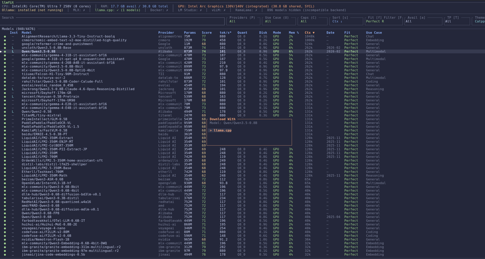
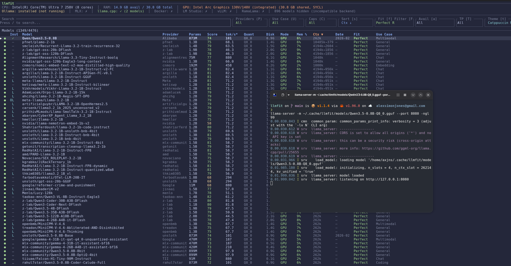
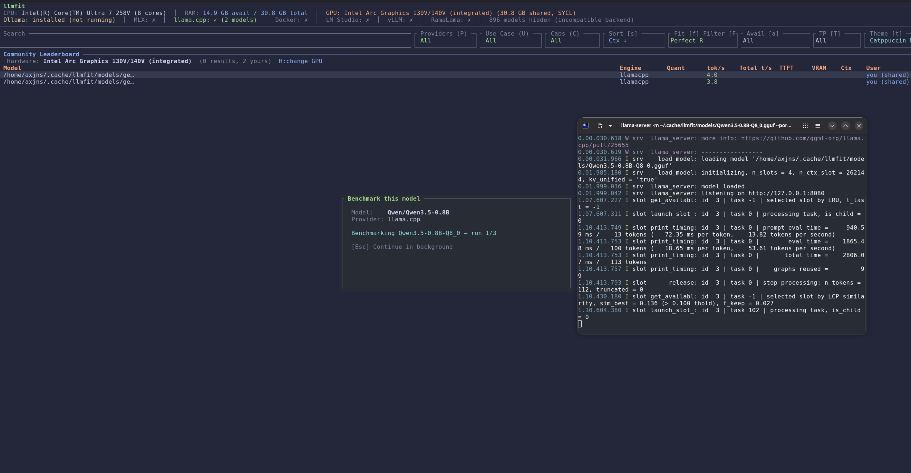
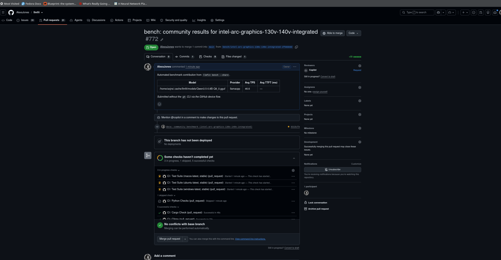

# Benchmarking Guide

A step-by-step walkthrough of the full benchmarking journey in the TUI: find a model, download it, serve it, measure real tok/s on your hardware, and (optionally) share the results back to the community as a GitHub PR — all without leaving llmfit.

[← Back to README](../README.md) · [TUI guide](tui.md) · [CLI benchmarking](cli.md#contributing-benchmarks-bench---share)

The journey:

1. [Download a model](#step-1--download-a-model)
2. [Serve it with a provider](#step-2--serve-the-model)
3. [Run the benchmark](#step-3--run-the-benchmark)
4. [Share your results as a PR](#step-4--share-your-results-optional)

---

## Step 1 — Download a model

Launch the TUI with `llmfit`. The table lists every model scored against your detected hardware.

1. Press `/` and type to search (e.g. `qwen3.5`), then `Enter` or `Esc` to leave search mode.
2. Navigate to the model with `↑`/`↓` or `j`/`k`.
3. Press `d` to download. If more than one provider can fetch the model, the **Download With** popup opens — pick one with `j`/`k` and confirm with `Enter`.



The download runs in the background. Press `D` to open the Download Manager and watch progress; GGUF files land in `~/.cache/llmfit/models` by default (editable in the Download Manager's Config section).

| Key | Action |
|-----|--------|
| `/` | Search models |
| `j` / `k` or arrows | Navigate |
| `d` | Download selected model (provider picker if several) |
| `j` / `k` + `Enter` | Choose provider in the Download With popup |
| `D` | Open Download Manager (progress, history, config) |

## Step 2 — Serve the model

Benchmarks run against a **live provider**, so start the model with your runtime of choice. For llama.cpp:

```sh
llama-server -m ~/.cache/llmfit/models/Qwen3.5-0.8B-Q8_0.gguf --port 8080 -ngl 99
```

Wait for `model loaded` / `listening on http://127.0.0.1:8080`. Back in the TUI, press `r` to refresh installed models — the model's row now shows it as installed, and the header shows the provider as detected (e.g. `llama.cpp: ✓ (1 models)`).



Ollama, vLLM, and MLX work the same way — llmfit auto-detects whatever is running. See [Runtime providers](providers.md) for endpoints and environment variables.

| Key | Action |
|-----|--------|
| `r` | Refresh installed models from runtime providers |
| `a` | Cycle availability filter (e.g. show only Installed) |

## Step 3 — Run the benchmark

With the served model **selected** in the table, press `b`. Because the model is installed and its provider is live, llmfit offers to benchmark it before showing the community leaderboard:



The **Benchmark this model** popup shows the model and provider it will measure. Press `Enter` to start — llmfit runs three real inference passes against the running server, measuring tokens per second and time-to-first-token. Press `Esc` at any point to let it continue in the background while you browse the leaderboard.

| Key | Action |
|-----|--------|
| `b` | Open leaderboard — offers to benchmark the selected installed model |
| `Enter` | Start the benchmark |
| `Space` / `s` | Toggle *share results as a PR* (see step 4) |
| `Esc` / `n` | Skip the offer and go straight to the leaderboard |
| `Esc` (while running) | Continue in the background |

Every run is saved locally first (`~/.config/llmfit` bench store), so nothing is lost if you skip sharing — you can upload the backlog any time with `llmfit bench --share`.

## Step 4 — Share your results (optional)

Before starting the run, press `Space` (or `s`) in the offer popup to enable sharing. When the benchmark finishes, llmfit forks the repo, commits your result, and opens a pull request automatically — no `gh` CLI required, authentication happens via the GitHub device flow (or set `GITHUB_TOKEN`).



Each merged submission ships in the next release: your measured numbers replace estimates in the fit table (marked with `✓`), and anyone on identical hardware gets calibrated estimates before they ever run a benchmark themselves. Your own shared runs appear in the leaderboard as `you (shared)`.

If the popup shows *no GitHub credentials*, set a token and relaunch:

```sh
export GITHUB_TOKEN="ghp_your_token"
llmfit
```

---

## Beyond the basics

- **Community leaderboard** (`b`) — real-world numbers from other users on your hardware, with `H` to browse results for any GPU. [Details →](tui.md#community-leaderboard-b)
- **Inference Bench** (`I`) — batch-benchmark every model across all running providers, plus quality scoring and a routing matrix. [Details →](tui.md#inference-bench-i)
- **CLI equivalents** — `llmfit bench`, `llmfit bench --all --share`, `--dry-run`, JSON output for scripting. [Details →](cli.md#contributing-benchmarks-bench---share)
